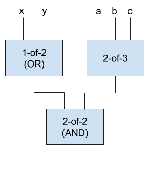

```
shortname: BEP-12
name: BigchainDB Transactions Spec v1
type: Standard
status: Stable
editor: Troy McConaghy <troy@bigchaindb.com>
```

# Abstract

This document contains a specification of a BigchainDB *transaction*, including:

- The pieces of a BigchainDB transaction.
- Explanations of how one can assemble or compute the pieces.
- What it means for a BigchainDB transaction to be "valid" and how to check for validity.

# Motivation

Anyone who wants to write a BigchainDB server or BigchainDB driver needs to know how to assembe, compute and check the validity of BigchainDB transactions. They don't want to read some example code and guess. They want a spec. This is that spec.

# Compatibility and Known Implementations

This spec was implemented and supported by BigchainDB Server 1.0, 1.0.1, 1.1, 1.2, and 1.3.

It was also implemented by several BigchainDB drivers. We may make a complete list some day. It's an old spec...

# Change Process

The process to change this document is [BEP-2 (COSS)](../2/README.md).

# Specification

**Contents**

<!-- Note that the TOC was auto-generated by a Visual Studio Code extension named "Markdown TOC" by AlanWalk>

<!-- TOC depthFrom:2 depthTo:3 -->

- [Introduction](#introduction)
- [Versioning](#versioning)
- [Example Transactions](#example-transactions)
- [Transaction Components](#transaction-components)
    - [Transaction Components: Transaction ID](#transaction-components-transaction-id)
    - [Transaction Components: Version](#transaction-components-version)
    - [Transaction Components: Inputs](#transaction-components-inputs)
    - [Transaction Components: Outputs](#transaction-components-outputs)
    - [Transaction Components: Conditions](#transaction-components-conditions)
    - [Transaction Components: Operation](#transaction-components-operation)
    - [Transaction Components: Asset](#transaction-components-asset)
    - [Transaction Components: Metadata](#transaction-components-metadata)
- [How to Construct a Transaction](#how-to-construct-a-transaction)
- [Common Operations](#common-operations)
    - [JSON Serialization and Deserialization](#json-serialization-and-deserialization)
    - [Converting Strings to Bytes](#converting-strings-to-bytes)
    - [Cryptographic Hashes](#cryptographic-hashes)
    - [Cryptographic Keys and Signatures](#cryptographic-keys-and-signatures)
- [Transaction Validation](#transaction-validation)
    - [How Validation Code Decides Which Version to Use](#how-validation-code-decides-which-version-to-use)
    - [JSON Schema Validation](#json-schema-validation)
    - [Other Constraints](#other-constraints)
- [Implementation-Specific Deviations](#implementation-specific-deviations)
    - [BigchainDB Server Deviations](#bigchaindb-server-deviations)
- [A Note about Owners](#a-note-about-owners)
- [Glossary](#glossary)
    - [associative array](#associative-array)
    - [list](#list)
    - [ctnull](#ctnull)

<!-- /TOC -->

## Introduction

Suppose Alice the accountant wants to store some information in the Awesome Accounting Network (AAN), a network which validates and stores BigchainDB transactions. First she would construct a BigchainDB transaction object on her computer. It must have a particular data structure. She would then convert that object into a sequence of bits or bytes to be sent to the AAN (i.e. she would serialize the transaction).

If she wants the transaction to get accepted and stored by the AAN, it must meet some requirements. This document (the BigchainDB Transaction Spec) explains those requirements, including:

- what’s in an BigchainDB transaction,
- how to construct a valid BigchainDB transaction,
- how to serialize/deserialize a BigchainDB transaction, and
- how to check if a BigchainDB transaction is valid.

In the rest of this document, "transaction" almost always means "BigchainDB transaction."

## Versioning

The BigchainDB Transaction Spec has several versions (e.g. version 1.0, version 2.0, etc.). Each one is documented completely in one Markdown file. For example, version 1.0 is documented in the file `v1.0/README.md`.

When is a new version created?

- A small change (e.g. a fix to a spelling error) won't lead to a new version number. (Git commit hashes can be used to distinguish those.)
- A change that adds a new feature in a backwards-compatible way will increase the minor version number, e.g. 3.4 to 3.5. A new spec file/document must be created.
- Backwards-incompatible changes will increase the major version number, e.g. 5.3 to 6.0. A new spec file/document must be created.

Also see the <a href="#transaction-components-version">section about the value of "version" inside transactions</a>.

## Example Transactions

You can find example transactions in:

- <a href="https://docs.bigchaindb.com/projects/py-driver/en/latest/index.html">the BigchainDB Python driver documentation</a>,
- <a href="https://docs.bigchaindb.com/projects/js-driver/en/latest/index.html">the BigchainDB JavaScript driver documentation</a>, and
- <a href="https://docs.bigchaindb.com/projects/server/en/latest/http-client-server-api.html">the docs about the HTTP API in the docs for BigchainDB Server</a>.

Be sure to check the value of `"version"` in the transaction.

## Transaction Components

A transaction can be implemented as an <a href="#associative-array"><span>associative array</span></a> in almost any programming language (e.g. as a dictionary in Python). A transaction has the following basic structure:

```text
{
    "id": id,
    "version": version,
    "inputs": inputs,
    "outputs": outputs,
    "operation": operation,
    "asset": asset,
    "metadata": metadata
}
```

You may wonder where the transaction signatures are. They’re in the inputs.

### Transaction Components: Transaction ID

The ID of a transaction is the SHA3-256 hash of the transaction, loosely speaking. It’s a string. An example is:

`"0e7a9a9047fdf39eb5ead7170ec412c6bffdbe8d7888966584b4014863e03518"`

Here are the steps to compute it:

First, construct an <a href="#associative-array"><span>associative array</span></a> named `d` of the form:

```text
{
    "version": version,
    "inputs": inputs,
    "outputs": outputs,
    "operation": operation,
    "asset": asset,
    "metadata": metadata
 }
```

**Note how `d` doesn't include a key-value pair for the `"id"` key.**

Next, in `d`, for each of the inputs in `inputs`, replace the value of each `fulfillment` with <a href="#ctnull"><span>ctnull</span></a> (e.g. `None` in Python). Call the resulting associative array `d2`.

Last, compute `id = hash_of_aa(d2)`. There’s pseudocode for the `hash_of_aa()` function on <a href="#computing-the-hash-of-an-associative-array">elsewhere in this document</a>. The result (`id`) is a string: the transaction ID.

### Transaction Components: Version

The version indicates the transaction validation rules to be used when validating the transaction, i.e. the rules associated with that version of the BigchainDB Transaction Spec. It must be a string like `"2.0"` or `"5.0"`.

If the value of `"version"` is `"2.0"`, for example, then the transaction will be validated according the <a href="#transaction-validation"><span>transaction validation rules</span></a> of version 2.0 of the BigchainDB Transaction Spec.

To indicate version 2.0, the only allowed value is `"2.0"` (not `"2"`, `"v2"`, `"v2.0"`, `"two"`, `"Jack's favorite version."` or anything else).

### Transaction Components: Inputs

The value of `"inputs"` is a <a href="#list"><span>list</span></a> of transaction inputs. (It might be implemented as an array, tuple, or something else in your programming language.)

Each transaction input spends/transfers a previous <a href="#transaction-components-outputs">transaction output</a>. A CREATE transaction must have exactly one input (i.e. `num_inputs == 1`). A TRANSFER transaction must have at least one input (i.e. `num_inputs >= 1`).

There’s a high-level overview of transaction inputs and outputs in <a href="https://docs.bigchaindb.com/en/latest/transaction-concepts.html">the BigchainDB root docs page about transaction concepts</a>. “Assets” are a core concept. Transaction inputs and outputs are the mechanism by which control or ownership of an asset (or shares of an asset) is transferred. (See the <a href="#a-note-about-owners">note about owners</a>.) Amounts of an asset are encoded in the outputs of a transaction, and each output may be spent separately. To spend an output, the output’s condition must be met by an input that provides a corresponding fulfillment. Each output may be spent at most once, by a single input.

An input can be implemented as an <a href="#associative-array"><span>associative array</span></a> in almost any programming language (e.g. as a dictionary in Python). It has the following basic structure:

```text
{
    "fulfills": {
        "transaction_id": transaction_id,
        "output_index": output_index
    },
    "owners_before": [public_key_1, public_key_2, etc.],
    "fulfillment": fulfillment
}
```

#### The Keys in a Transaction Input

**fulfills**

If the transaction is a TRANSFER transaction, then this is like a pointer to the <a href="#transaction-components-outputs"><span>output</span></a> being spent/transferred. More specifically, it’s an <a href="#associative-array"><span>associative array</span></a> with two key/value pairs:

- `transaction_id` is the <a href="#transaction-components-transaction-id">ID of the transaction</a> where the output is located. It’s a string.
- `output_index` is the index of the output being spent. It’s an integer, *not a string*. Example values are `0`, `1` and `12` (*not* `"0"`, `"Roger's index"` or any other string).

An example value is:

```json
{
    "transaction_id": "107ec21f4c53cd2a934941010437ac74882161bcbefdfd7664268823fc347996",
    "output_index": 0
}
```

If the transaction is a CREATE transaction, then the value of `fulfills` must be <a href="#ctnull"><span>ctnull</span></a> (e.g. `None` in Python), because there is no other transaction output that it’s transferring/spending.

**owners\_before**

This is a <a href="#list"><span>list</span></a> of public keys (Base58-encoded Ed25519 keys; see the <a href="#cryptographic-keys-and-signatures">section about cryptographic keys and signatures</a>).

If the transaction is a CREATE transaction, then this is a <a href="#list"><span>list</span></a> of public keys (strings): the *issuers* of the asset in question. Those issuers must sign the CREATE transaction, i.e. they must compute the `fulfillment` string using their private keys.

If the transaction is a TRANSFER transaction, then this <a href="#list"><span>list</span></a> must agree with the `public_keys` list in the <a href="#transaction-components-outputs"><span>output</span></a> being transferred/spent.

One must be careful when interpreting public keys as "owners." See the <a href="#a-note-about-owners"><span>note about owners</span></a>.

**fulfillment**

This is a string. An example fulfillment string is:

    "pGSAIDgbT-nnN57wgI4Cx17gFHv3UB_pIeAzwZCk10rAjs9bgUDxyNnXMl-5PFgSIOrN7br2Tz59MiWe2XY0zlC7LcN52PKhpmdRtcr7GR1PXuTfQ9dE3vGhv7LHn6QqDD6qYHYM"

If the transaction is a CREATE transaction, then the fulfillment must fulfill an implicit *n*-of-*n* signature condition, i.e. one signature from each of the *n* `owners_before`.

If the transaction is a TRANSFER transaction, then the fulfillment must fulfill the condition in the <a href="#transaction-components-outputs"><span>output</span></a> that is being transferred/spent. The section about <a href="#transaction-components-conditions"><span>conditions</span></a> explains how to construct a condition object.

The specifics of how to compute a fulfillment for a condition (and the associated fulfillment string) are given in the crypto-conditions spec. Consult the <a href="https://tools.ietf.org/html/draft-thomas-crypto-conditions-03">crypto-conditions spec (version 03)</a> or use <a href="https://github.com/rfcs/crypto-conditions#implementations">an existing implementation of crypto-conditions</a>. The section about <a href="#how-to-construct-a-transaction"><span>how to construct a transaction</span></a> gives more details, including a link to example Python code.

> An Aside: The basic steps to compute a fulfillment string are: 1. Construct the fulfillment as per the crypto-conditions spec. 2. Encode the fulfillment to bytes using the <a href="http://www.itu.int/ITU-T/recommendations/rec.aspx?rec=12483&amp;lang=en">ASN.1 Distinguished Encoding Rules (DER)</a>. 3. Encode the resulting bytes using “base64url” (*not* typical base64) as per <a href="https://tools.ietf.org/html/rfc4648#section-5">RFC 4648, Section 5</a>.

### Transaction Components: Outputs

The value of `"outputs"` is a <a href="#list"><span>list</span></a> of transaction outputs. (It might be implemented as an array, tuple, or something else in your programming language.)

Each output indicates the crypto-conditions which must be satisfied by anyone wishing to spend/transfer that output. It also indicates the number of shares of the asset tied to that output.

An output can be implemented as an <a href="#associative-array"><span>associative array</span></a> in almost any programming language (e.g. as a dictionary in Python). It has the following basic structure:

```text
{
    "condition": condition,
    "public_keys": [public_key_1, public_key_2, etc.],
    "amount": amount
}
```

#### The Keys in a Transaction Output

**condition**

See the <a href="#transaction-components-conditions"><span>section about conditions</span></a>.

**public\_keys**

This is a <a href="#list"><span>list</span></a> of public keys (Base58-encoded Ed25519 keys; see the <a href="#cryptographic-keys-and-signatures">section about cryptographic keys and signatures</a>).

It should be consistent with the public keys in the `condition`.

**amount**

This is the amount of the asset associated with the output in question. Sometimes we say it's the "number of shares" of the asset associated with that output.

For example, suppose Jack Spratt wants to track 256 paperclips. He could make a CREATE transaction with one output where `amount` is equal to `"256"`. Another option would be for Jack to make a CREATE transaction with two outputs, one with `amount` `"200"` and the other with `amount` `"56"`.

If Jack did the latter, he could make a TRANSFER transaction to transfer the 56 paperclips to several other people. For example, he could transfer 10 to Sue, 40 to Arthur, and 6 to Sally. There would be three outputs, with amounts `"10"`, `"40"` and `"6"`. (The conditions of those outputs are where one would indicate the new owners.)

In general, in a TRANSFER transaction, the sum of the output amounts must be the same as the sum of the outputs that it transfers (i.e. the sum of the "input amounts").

### Transaction Components: Conditions

A condition can be implemented as an <a href="#associative-array"><span>associative array</span></a> in almost any programming language (e.g. as a dictionary in Python). It has the following basic structure:

```text
{
    "details": subcondition,
    "uri": uri
}
```

#### Subconditions

A subcondition can be implemented as an <a href="#associative-array"><span>associative array</span></a>. There are two possible subcondition types:

1. ED25519-SHA-256
1. THRESHOLD-SHA-256

Those names are from the <a href="https://tools.ietf.org/html/draft-thomas-crypto-conditions-03">crypto-conditions specification (spec)</a>. (It calls them "crypto-condition types.") The crypto-conditions spec includes other types, but the above types are the only ones used (currently).

Note: This version of the BigchainDB Transaction Spec conforms to versions 02 and 03 of the crypto-conditions spec. (The parts that it uses didn’t change from version 02 to 03.)

##### Type 1: ED25519-SHA-256

A subcondition of type ED25519-SHA-256 can be implemented as an <a href="#associative-array"><span>associative array</span></a>. Here’s a JSON example:

```json
{
    "type": "ed25519-sha-256",
    "public_key": "HFp773FH21sPFrn4y8wX3Ddrkzhqy4La4cQLfePT2vz7"
}
```

The `type` must be the string `"ed25519-sha-256"`.

The `public_key` must be a valid public key (string). See the section about <a href="#cryptographic-keys-and-signatures"><span>cryptographic keys and signatures</span></a>.

One can fulfill a (sub)condition of this type by signing a message with the private key corresponding to the given public key.

##### Type 2: THRESHOLD-SHA-256

A subcondition of type THRESHOLD-SHA-256 can be implemented as an <a href="#associative-array"><span>associative array</span></a>. It has the following basic structure:

```text
{
    "type": "threshold-sha-256",
    "threshold": threshold,
    "subconditions": [subcondition_1, subcondition_2, etc.]
}
```

The `type` must be the string `"threshold-sha-256"`.

The `threshold` must be an integer *m* between 1 and the number of objects in the `subconditions` <a href="#list"><span>list</span></a> (*n*). It’s *not a string*.

The `subconditions` must be a <a href="#list"><span>list</span></a> of one or more subconditions (*n* associative arrays). Note the recursive definition: a threshold subcondition contains a <a href="#list"><span>list</span></a> of subconditions, some of which may be subconditions of type THRESHOLD-SHA-256.

One can fulfill a (sub)condition of this type by fulfilling *m* of the *n* subconditions. Because of that, it’s also called an *m*-of-*n* threshold condition. An *m*-of-*n* threshold condition can be thought of as a logic gate with n Boolean inputs, where the output is TRUE if, and only if, *m* or more of the inputs are TRUE. Therefore:

- 1-of-*n* is the same as a logical OR of all the inputs, e.g. `1 of {x, y, z} == x OR y OR z`
- *n*-of-*n* is the same as a logical AND of all the inputs. e.g. `3 of {x, y, z} == x AND y AND z`

#### The URI

If you want to generate a correct condition URI string, then you should consult the <a href="https://tools.ietf.org/html/draft-thomas-crypto-conditions-03">crypto-conditions spec (version 03)</a> or use <a href="https://github.com/rfcs/crypto-conditions#implementations">an existing implementation of crypto-conditions</a>.

There is some example Python 3 code for calculating condition URI strings below.

#### More Complex Conditions

The (single) output of a threshold condition can be used as one of the inputs to *another* threshold condition. That means you can combine threshold conditions to build complex expressions such as `(x OR y) AND (2 of {a, b, c})`.



#### Cost of a Condition

When you create a condition, you can calculate its <a href="https://tools.ietf.org/html/draft-thomas-crypto-conditions-03#section-7.2.2">cost</a>, an estimate of the resources that would be required to validate the fulfillment. For example, the cost of one ED25519-SHA-256 condition is 131072.

An implementation of a BigchainDB server may choose to put an upper limit on the complexity of each condition, either directly by setting a maximum allowed cost, or indirectly by setting a maximum allowed transaction size.

#### Example Conditions

##### The Simplest Possible Condition

The simplest possible condition is one with a single ED25519-SHA-256 signature (sub)condition. Here’s a JSON example:

```json
{
    "details": {
        "type": "ed25519-sha-256",
        "public_key": "HFp773FH21sPFrn4y8wX3Ddrkzhqy4La4cQLfePT2vz7"
    },
    "uri": "ni:///sha-256;at0MY6Ye8yvidsgL9FrnKmsVzX0XrNNXFmuAPF4bQeU?fpt=ed25519-sha-256&cost=131072"
}
```

**Example Python 3 Code to Compute the Condition URI**

```python
import base58
from cryptoconditions import Ed25519Sha256

pubkey = 'HFp773FH21sPFrn4y8wX3Ddrkzhqy4La4cQLfePT2vz7'

# Convert pubkey to a bytes representation (a Python 3 bytes object)
pubkey_bytes = base58.b58decode(pubkey)

# Construct the condition object
ed25519 = Ed25519Sha256(public_key=pubkey_bytes)

# Compute the condition uri (string)
uri = ed25519.condition_uri
# uri should be:
# 'ni:///sha-256;at0MY6Ye8yvidsgL9FrnKmsVzX0XrNNXFmuAPF4bQeU?fpt=ed25519-sha-256&cost=131072'
```

##### A 2-of-2 Condition

Here’s an example 2-of-2 condition (JSON):

```json
{
    "details": {
        "type": "threshold-sha-256",
        "threshold": 2,
        "subconditions": [
            {
                "type": "ed25519-sha-256",
                "public_key": "5ycPMinRx7D7e6wYXLNLa3TCtQrMQfjkap4ih7JVJy3h"
            },
            {
                "type": "ed25519-sha-256",
                "public_key": "9RSas2uCxR5sx1rJoUgcd2PB3tBK7KXuCHbUMbnH3X1M"
            }
        ]
    },
    "uri": "ni:///sha-256;zr5oThl2kk6613WKGFDg-JGu00Fv88nXcDcp6Cyr0Vw?fpt=threshold-sha-256&cost=264192&subtypes=ed25519-sha-256"
}
```

**Example Python 3 Code to Compute the Condition URI**

```python
import base58
from cryptoconditions import Ed25519Sha256, ThresholdSha256

pubkey1 = '5ycPMinRx7D7e6wYXLNLa3TCtQrMQfjkap4ih7JVJy3h'
pubkey2 = '9RSas2uCxR5sx1rJoUgcd2PB3tBK7KXuCHbUMbnH3X1M'

# Convert pubkeys to bytes representations (Python 3 bytes objects)
pubkey1_bytes = base58.b58decode(pubkey1)
pubkey2_bytes = base58.b58decode(pubkey2)

# Construct the condition object
ed25519_1 = Ed25519Sha256(public_key=pubkey1_bytes)
ed25519_2 = Ed25519Sha256(public_key=pubkey2_bytes)
threshold_sha256 = ThresholdSha256(threshold=2)
threshold_sha256.add_subfulfillment(ed25519_1)
threshold_sha256.add_subfulfillment(ed25519_2)

# Compute the condition uri (string)
uri = threshold_sha256.condition.serialize_uri()
# uri should be:
# 'ni:///sha-256;zr5oThl2kk6613WKGFDg-JGu00Fv88nXcDcp6Cyr0Vw?fpt=threshold-sha-256&cost=264192&subtypes=ed25519-sha-256'
```

To change it into a 1-of-2 condition, just change the value of `threshold` to 1 and recompute the condition URI.

### Transaction Components: Operation

The operation indicates the type/kind of transaction, and how it should be validated. It must be a string. The allowed values are `"CREATE"` and `"TRANSFER"`.

Note: Some implementations may allow other values, but maybe only internally. For example, BigchainDB Server allows the value `"GENESIS"`. See <a href="#implementation-specific-deviations"><span>the section about implementation-specific deviations</span></a>.

### Transaction Components: Asset

In a CREATE transaction, an asset can be <a href="#ctnull"><span>ctnull</span></a> (e.g. `None` in Python), or an <a href="#associative-array"><span>associative array</span></a> containing exactly one key-value pair. The key must be `"data"` and the value can be any valid associative array. Here’s a JSON example:

```json
{
    "data": {
        "desc": "Laundromat Fantastique",
        "address": "461B Grand Palace Road",
        "international_laundromat_identifier": "bx45-am-333",
        "known_issues": "No known issues. It's fantastique!"
    }
}
```

The meaning of a “valid associative array” may depend on the implementation; see the section about <a href="#implementation-specific-deviations"><span>implementation-specific deviations</span></a>.

In a TRANSFER transaction, an asset must be an <a href="#associative-array"><span>associative array</span></a> containing exactly one key-value pair. The key must be `"id"` and the value must be a 64-character hex string: a <a href="#transaction-components-transaction-id"><span>transaction ID</span></a>. Here’s a JSON example:

```json
{
    "id": "38100137cea87fb9bd751e2372abb2c73e7d5bcf39d940a5516a324d9c7fb88d"
}
```

### Transaction Components: Metadata

User-provided transaction metadata.

It can be any valid <a href="#associative-array"><span>associative array</span></a>, or <a href="#ctnull"><span>ctnull</span></a> (e.g. `None` in Python). The meaning of a “valid associative array” may depend on the implementation; see the section about <a href="#implementation-specific-deviations"><span>implementation-specific deviations</span></a>. Here’s a JSON example:

```json
{
    "timestamp": "1510850314",
    "weather_conditions": "So hot that our crayons melted.",
    "location": {
        "name": "Death Valley, California",
        "latitude": "36.457N",
        "longitude": "116.865W"
    }
}
```

## How to Construct a Transaction

Here's how you construct a valid transaction:

1. Set a variable named `version` to a <a href="#transaction-components-version"><span>valid version value</span></a>.

2. Set a variable named `operation` to a <a href="#transaction-components-operation"><span>valid operation value</span></a>.

3. Set a variable named `asset` to a <a href="#transaction-components-asset"><span>valid asset value</span></a>.

4. Set a variable named `metadata` to a <a href="#transaction-components-metadata"><span>valid metadata value</span></a>.

5. Generate or get all the required <a href="#cryptographic-keys-and-signatures"><span>public keys</span></a> (i.e. keys of asset issuers, keys of old owners, keys of new owners).

6. Construct a <a href="#list"><span>list</span></a> named `outputs` of all the <a href="#transaction-components-outputs"><span>outputs</span></a> that should be in the transaction. (Note: Each output includes a <a href="#transaction-components-conditions"><span>condition</span></a>.)

7. Construct a <a href="#list"><span>list</span></a> named `unfulfilled_inputs` of all the <a href="#transaction-components-inputs"><span>inputs</span></a> that should be in the transaction. All fulfillment strings should be set to <a href="#ctnull"><span>ctnull</span></a> (e.g. `None` in Python). (We’re building an “unfulfilled transaction” first.)

8. <a href="#transaction-components-transaction-id">Compute the transaction ID</a> and store it in a variable named `id`.

9. Construct an <a href="#associative-array"><span>associative array</span></a> named `tx1` of the form:

    ```text
    {
        "id": id,
        "version": version,
        "inputs": unfulfilled_inputs,
        "outputs": outputs,
        "operation": operation,
        "asset": asset,
        "metadata": metadata
    }
    ```
    The result (`tx1`) is the <a href="#associative-array"><span>associative array</span></a> form of an "unfulfilled transaction." We use that to construct the associated fulfilled transaction.

10.  <a href="#json-serialization-and-deserialization"><span>Convert tx1 to a BigchainDB-standard JSON string</span></a> named `tx1_json`.

11. <a href="#converting-strings-to-bytes"><span>Convert tx1_json to bytes</span></a>. Call the result `tx1_bytes`.

12. Create `inputs` as a deep copy of `unfulfilled_inputs`.

13. For each input in `inputs`, fulfill the associated crypto-condition using an implementation of crypto-conditions. You will need `tx1_bytes` and one of more private keys (which are used to sign `tx1_bytes`). The end result is usually some kind of fulfilled condition object. Compute the fulfillment string of that fulfilled condition object, and put that as the value of `fulfillment` for the input in question.

14. Construct `final_tx` by making a deep copy of `tx1` and setting the value of the `"inputs"` key to `inputs`.

The final result (`final_tx`) is a valid fulfilled transaction (in the form of an associative array). To put it in the body of an HTTP POST request, you’ll have to <a href="#json-serialization-and-deserialization"><span>convert it to a JSON string</span></a>.

**Example Python Code**

The documentation of the BigchainDB Python Driver has a page titled <a href="https://docs.bigchaindb.com/projects/py-driver/en/latest/handcraft.html">“Handcrafting Transactions”</a> which shows how to do all of the above in Python (using a Python implementation of crypto-conditions).

## Common Operations

### JSON Serialization and Deserialization

In the BigchainDB Transaction Spec, “JSON serialization” is the standard process to convert an <a href="#associative-array"><span>associative array</span></a> (such as a Python dict) to a standard Unicode JSON string. “JSON deserialization” is the reverse. In the BigchainDB Transaction Spec, some constraints are imposed on the JSON string:

- All keys must be strings
- The separator after each key is `:` with no spaces on either side.
- The separator after each value (except the last one) is `,` with no spaces on either side and no newline or carriage return.
- The string is Unicode (not just ASCII)
- In the JSON string, all keys are sorted by key name (because associative arrays don’t have an implicit order, but we need there to be only *one* JSON string associated with a given associative array)

There are several JSON standards, notably RFC 7159 and ECMA-404.

For JSON serialization and deserialization, the BigchainDB Transaction Spec follows what RapidJSON does. <a href="https://github.com/Tencent/rapidjson">RapidJSON</a> is a fast C++ JSON library. According to <a href="http://rapidjson.org/">the RapidJSON documentation</a>, “RapidJSON should be in full compliance with RFC7159/ECMA-404, with optional support of relaxed syntax.”

Most common programming languages have one or more libraries/packages which can do the same as RapidJSON.

**Example Python 3 Code**

There’s a Python 3 wrapper around RapidJSON called <a href="https://github.com/python-rapidjson/python-rapidjson">python-rapidjson</a>. In Python, associative arrays are implemented as dictionaries. To convert a dictionary to a standard Unicode JSON string (Python 3 <a href="https://docs.python.org/3/library/stdtypes.html#text-sequence-type-str">str object</a>, standard in the sense of the BigchainDB Transaction Spec):

```python
import rapidjson

# input_dict is a dictionary
json_str = rapidjson.dumps(input_dict,
                            skipkeys=False,
                            ensure_ascii=False,
                            sort_keys=True)
```

- `skipkeys=False` ensures all keys are strings. If they’re not, the serialization will fail.
- `ensure_ascii=False` allows non-ASCII Unicode characters to pass through into the resulting Python 3 <a href="https://docs.python.org/3/library/stdtypes.html#text-sequence-type-str">str object</a>.
- `sort_keys=True` ensures the JSON output is sorted by key.

The python-rapidjson documentation has a <a href="https://python-rapidjson.readthedocs.io/en/latest/dumps.html">page about the dumps() function</a>.

To deserialize a standard Unicode JSON string to a dictionary:

```python
new_dict = rapidjson.loads(json_str)
```

### Converting Strings to Bytes

Most common programming languages have some way to convert a Unicode string to bytes. To do that, one must specify the encoding; in the case of the BigchainDB Transaction Spec, the encoding must be <a href="https://en.wikipedia.org/wiki/UTF-8">UTF-8</a>.

**Example Python 3 Code**

If `example_string` is a Python 3 <a href="https://docs.python.org/3/library/stdtypes.html#text-sequence-type-str">str object</a> (an immutable sequence of Unicode code points), then it can be converted to a Python 3 <a href="https://docs.python.org/3/library/stdtypes.html#bytes-objects">bytes object</a> using:

```python
example_bytes = example_str.encode()
```

That works because the Python 3 <a href="https://docs.python.org/3/library/stdtypes.html#str.encode">str.encode() method</a> assumes a UTF-8 encoding by default.

### Cryptographic Hashes

#### BigchainDB-Standard Hashes

When computing a cryptographic hash (such as the <a href="#transaction-components-transaction-id"><span>Transaction ID</span></a>), and *not* falling back to some other protocol (such as crypto-conditions) to specify how the hash should be computed, the computed hash must be a NIST-standard SHA3-256 hash.

> **Warning: During the finalization of SHA3, NIST changed the delimiter suffix from 0x01 to 0x06. Older SHA3 libraries might use the old suffix, so make sure you use an up-to-date library when calculating SHA3-256 hashes.**

A SHA3-256 hash can be represented as a sequence of 256 bits, 32 bytes, or many other ways. When representing SHA3-256 hashes as strings (e.g. inside transactions), they must be represented with a hexadecimal encoding: a sequence of hexadecimal digits (0–9 and a–f). Every byte can be represented by two hexadecimal digits so the hexadecimal string should have 64 characters. An example is:

`"ee788e85a9b5ae9aa9af4fe71458e8b3b72d2e0f290f3e6bc0bdaa262b60a860"`

**Example Python 3 Code**

Install the package pysha3 1.0 or greater (from PyPI). It’s a wrapper around <a href="https://github.com/gvanas/KeccakCodePackage">the optimized Keccak Code Package (KCP)</a>. The following code snippet calculates the SHA3-256 hash of the input `json_bytes` (a Python 3 <a href="https://docs.python.org/3/library/stdtypes.html#bytes-objects">bytes object</a>) and then converts it to a hexadecimal string (a Python 3 <a href="https://docs.python.org/3/library/stdtypes.html#text-sequence-type-str">str object</a>).

```python
import sha3

# json_bytes is a bytes object
hash_as_hex_string = sha3.sha3_256(json_bytes).hexdigest()
```

Note: `sha3.sha3_256(json_bytes)` is an intermediate object of class `_pysha3.sha3_256`.

#### Computing the Hash of an Associative Array

There’s a BigchainDB-standard way to compute the hash of an <a href="#associative-array"><span>associative array</span></a>. We’ve called that function `hash_of_aa()` elsewhere in this documentation. It takes an associative array `d` as input and returns a string as output. Here is what that function must do:

1.  Convert `d` to a standard Unicode JSON string. See the section about <a href="#json-serialization-and-deserialization"><span>JSON serialization and deserialization</span></a>. Call the resulting string `d_json`.
2.  Convert `d_json` to bytes (i.e. a sequence of bytes). See the section about <a href="#converting-strings-to-bytes"><span>converting strings to bytes</span></a>. Call the resulting bytes `d_bytes`.
3.  Compute the SHA3-256 hash of `d_bytes` as outlined above, and represent the hash as a hexadecimal string.

### Cryptographic Keys and Signatures

The BigchainDB Transaction Spec uses the <a href="https://ed25519.cr.yp.to/">Ed25519</a> public-key signature system for:

- generating public/private key pairs (also called verifying/signing key pairs),
- calculating signatures, and
- verifying signatures.

Ed25519 is an instance of the <a href="https://en.wikipedia.org/wiki/EdDSA">Edwards-curve Digital Signature Algorithm (EdDSA)</a>. There’s more information about EdDSA and Ed25519 in <a href="https://tools.ietf.org/html/rfc8032">RFC 8032</a>.

When representing public/private keys as strings (e.g. inside transactions), they must be represented with a <a href="https://en.wikipedia.org/wiki/Base58">Base58 encoding</a>.

> **Warning: There is no standard for Base58 encoding. The meaning of Base58 varies from library to library. The Base58 encoding used by the BigchainDB Transaction Spec is that which is implemented by <a href="https://pypi.python.org/pypi/base58">the Python package named base58</a>, which is the same as what’s used for Bitcoin addresses.**

Here’s an example Ed25519 public/private key pair:

```json
{
    "public": "9WYFf8T65bv4S8jKU8wongKPD4AmMZAwvk1absFDbYLM",
    "private": "3x7MQpPq8AEUGEuzAxSVHjU1FhLWVQJKFNNkvHhJPGCX"
}
```

To sign a message, one uses a private key, i.e. signature = signing\_function(message, private\_key). To verify a signature, one needs the corresponding public key, i.e. signature\_is\_valid = verifying\_function(message, public\_key, signature). The signing\_function and verifying\_function are provided by the Ed25519 signature system. The reference implementation of Ed25519 is in the <a href="https://nacl.cr.yp.to/">Networking and Cryptography Library (NaCl)</a>, but there are <a href="https://ianix.com/pub/ed25519-deployment.html">many other implementations</a>.

When representing calculated *signatures* as strings, they must be represented with a <a href="https://en.wikipedia.org/wiki/Base58">Base58 encoding</a>. Here’s an example signature:

    "8Z6GJFLSvHmWVqN4dJHshcamNR3cYMwsk9bKScjd32ZgMEtbVSrujHDqrPpdyzBo3tpdse4N4YHXZGXdHfjZZhH"

The keys and signatures that go into <a href="#transaction-components-outputs"><span>outputs</span></a> and <a href="#transaction-components-inputs"><span>inputs</span></a> follow the <a href="https://tools.ietf.org/html/draft-thomas-crypto-conditions-03">crypto-conditions specification</a>. However, the BigchainDB Transaction Spec only allows for Ed25519 keys and signatures. (It doesn’t allow for the RSA ones which are also part of the crypto-conditions specification.) The Ed25519 functions used to generate keys, calculate signatures, and verify signatures are the *same* across the BigchainDB Transaction Spec. Those calculations aren’t done differently inside inputs or outputs.

**Example Python 3 Code**

The Python package <a href="https://pypi.python.org/pypi/BigchainDB">BigchainDB</a> is a Python 3 reference implementation of a BigchainDB-compliant server. Its source code is in the <a href="https://github.com/bigchaindb/bigchaindb/">bigchaindb/bigchaindb</a> repository on GitHub. There you can see how it generates public/private key pairs, calculates signatures, and verifies signatures: it uses the <a href="https://github.com/bigchaindb/cryptoconditions">cryptoconditions package</a>. The cryptoconditions package, in turn, uses the <a href="https://pypi.python.org/pypi/PyNaCl">PyNaCl package</a>, a Python binding to <a href="https://github.com/jedisct1/libsodium">libsodium</a>, which is a fork of the Networking and Cryptography library.

#### Computing the Signature of an Associative Array

There’s a BigchainDB-standard way to compute the signature of an <a href="#associative-array"><span>associative array</span></a>. We’ve called that function `sig_of_aa()` elsewhere in this documentation. It takes two inputs: an associative array `d` and a `private_key`. It returns a signature string as output. Here is what that function must do:

1.  Convert `d` to a standard Unicode JSON string. See the section about <a href="#json-serialization-and-deserialization"><span>JSON serialization and deserialization</span></a>. Call the resulting string `d_json`.
2.  Convert `d_json` to bytes (i.e. a sequence of bytes). See the section about <a href="#converting-strings-to-bytes"><span>converting strings to bytes</span></a>. Call the resulting bytes `d_bytes`.
3.  Calculate the Ed25519 signature of `d_bytes` using the given `private_key`.

## Transaction Validation

If a transaction satisfies the constraints (or rules) listed below, then it is considered valid. The process of checking those constraints is called transaction validation.

Each version of the BigchainDB Transaction Spec may have different constraints. That is, the constraints may change from one version to the next. See the <a href="#versioning">section on versioning</a> and the <a href="#transaction-components-version">section on transaction version</a>.

### How Validation Code Decides Which Version to Use

When given a transaction to validate, validation code should check the value of `"version"` inside the transaction. The valid values are those with a corresponding set of JSON Schema files which can be found in the `bigchaindb/bigchaindb/common/schema/` directory of the `bigchaindb/bigchaindb` repository on GitHub. If `"version"` doesn’t have a valid value, then the transaction is invalid. Otherwise, the transaction should be validated according to the validation constraints described in that version of the BigchainDB Transaction Spec.

### JSON Schema Validation

JSON Schema Validation is done by checking the transaction against a formal <a href="http://json-schema.org/">JSON Schema</a> defined in a set of <a href="http://json-schema.org/">JSON Schema</a> files. At the time of writing, those files could be found in the `bigchaindb/common/schema/` directory of [the bigchaindb/bigchaindb repository on GitHub](https://github.com/bigchaindb/bigchaindb).

Tip 1: There’s a nice explanation of JSON Schema in the website <a href="https://spacetelescope.github.io/understanding-json-schema/index.html">“Understanding JSON Schema”</a>.

Tip 2: Python 3 code for checking a transaction against JSON Schema files can be found in the <a href="https://github.com/bigchaindb/bigchaindb">source code of BigchainDB Server</a>. At the time of writing, it was in the file `bigchaindb/common/schema/__init__.py`.

### Other Constraints

#### The output.amount Rule

For all outputs, once output.amount has been converted from a string to an integer, it must be between 1 and 9×10^18, inclusive. The reason for the upper bound is to keep amount within what a server can comfortably represent using a 64-bit signed integer, i.e. 9×10^18 is less than 2^63.

#### The Duplicate Transaction Rule

If a transaction is a duplicate of a previous transaction, then it’s invalid. A quick way to check that is by checking to see if a transaction with the same transaction ID is already stored.

#### The Transaction ID Rule

The transaction ID (`id`) must be valid in that it must agree with the hash computed using the instructions given on <a href="#transaction-components-transaction-id"><span>the section about transaction ID</span></a>.

#### The TRANSFER Transaction Rules

If a transaction is a TRANSFER transaction:

1. If an input attempts to fulfill an output that has already been fulfilled (i.e. spent or transferred) by a previous valid transaction, then the transaction is invalid. (You don’t have to check if the fulfillment string is valid.)
1. If two or more inputs (in the transaction being validated) attempt to fulfill the *same* output, then the transaction is invalid. (You don’t have to check any fulfillment strings.)
1. The sum of the amounts on the inputs must equal the sum of the amounts on the outputs. In other words, a TRANSFER transaction can’t create or destroy asset shares.
1. For all inputs, if `input.fulfills` points to:  
   - a transaction that doesn’t exist, then it’s invalid.
   - a transaction that’s invalid, then it’s invalid. (This check may be skipped if invalid transactions are never kept.)
   - a transaction output that doesn’t exist, then it’s invalid.
   - a transaction with an asset ID that’s different from *this* transaction’s asset ID, then this transaction is invalid. (The asset ID of a CREATE transaction is the same as the transaction ID. The asset ID of a TRANSFER transaction is asset.id.)

Note: The first two rules prevent double spending.

#### The input.fulfillment Rule

Regardless of whether the transaction is a CREATE or TRANSFER transaction: For all inputs, `input.fulfillment` must be valid. See the <a href="#transaction-components-inputs"><span>section about inputs</span></a> for more details about what that means.

#### More Rules

Some implementations of the BigchainDB Transactions Spec impose more rules. See the section titled [Implementation-Specific Deviations](#implementation-specific-deviations).


## Implementation-Specific Deviations

Some implementations of BigchainDB-compliant servers or drivers deviate from the BigchainDB Transaction Spec.

### BigchainDB Server Deviations

<a href="https://github.com/bigchaindb/bigchaindb">BigchainDB Server</a> is a BigchainDB-compliant server implemented in Python.

It allows <a href="#transaction-components-operation"><span>operation</span></a> to have the value `"GENESIS"`, but only for transactions in the GENESIS block.

When BigchainDB Server is used *with MongoDB*, it inherits some quirks from MongoDB:

- All key names (e.g. anywhere in the JSON documents stored in `asset.data` or `metadata`):
  - must not begin with `$`
  - must not contain `.`
  - must not contain the <a href="https://en.wikipedia.org/wiki/Null_character">null character</a> (Unicode code point U+0000)

- If there’s a key named `"language"` anywhere in the JSON documents stored in `asset.data` or `metadata`, then its value must be one of the <a href="https://docs.mongodb.com/manual/reference/text-search-languages/">supported values (language codes)</a>, because MongoDB uses that to guide its full text search. Moreover, BigchainDB Server only allows the language codes supported by *MongoDB Community Edition* (not MongoDB Enterprise).

## A Note about Owners

The public keys associated with an unspent output are sometimes called the “owners” of the associated shares in an asset, but the legal entities associated with those public keys may or may not be “owners” in any legal sense. The most that *can* be said is that those public keys are associated with the ability to fulfill the conditions on the output.

External contracts or other legal agreements may establish stronger interpretations in specific cases.

## Glossary

### associative array

A collection of key/value (or name/value) pairs such that each possible key appears at most once in the collection. In JavaScript (and JSON), all objects behave as associative arrays with string-valued keys. In Python and .NET, associative arrays are called *dictionaries*. In Java and Go, they are called *maps*. In Ruby, they are called *hashes*. See also: Wikipedia’s articles for <a href="https://en.wikipedia.org/wiki/Associative_array"><span>Associative array</span></a> and <a href="https://en.wikipedia.org/wiki/Comparison_of_programming_languages_(associative_array)">Comparison of programming languages (associative array)</a>

### list

In this document, when we say "list", we mean a finite ordered collection. Every programming language has one or more ways of handling those, e.g. lists, tuples or arrays. They are arrays in JSON.

### ctnull

Any value which, when converted to JSON, becomes `null`. "ctnull" is short for "converts to null." `null` in JavaScript, JSON, Java and C#. `None` in Python. `nil` in Ruby and Go.

------------------------------------------------------------------------

# Copyright Waiver

<p xmlns:dct="http://purl.org/dc/terms/">
  <a rel="license"
     href="http://creativecommons.org/publicdomain/zero/1.0/">
    
  </a>
  <br />
  To the extent possible under law, all contributors to this BEP
  have waived all copyright and related or neighboring rights to this BEP.
</p>
