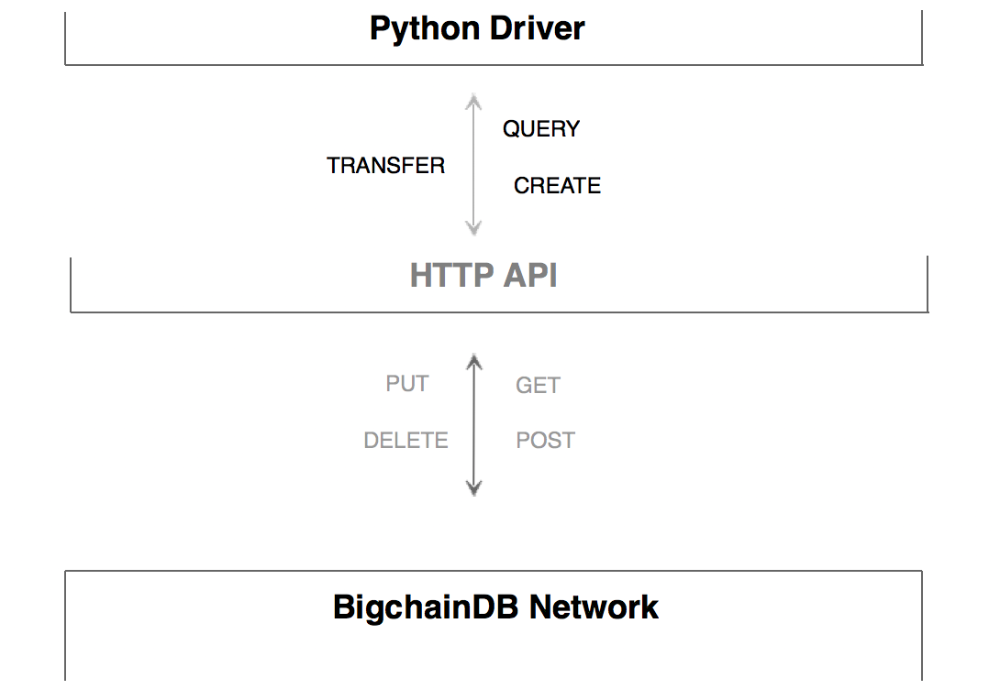
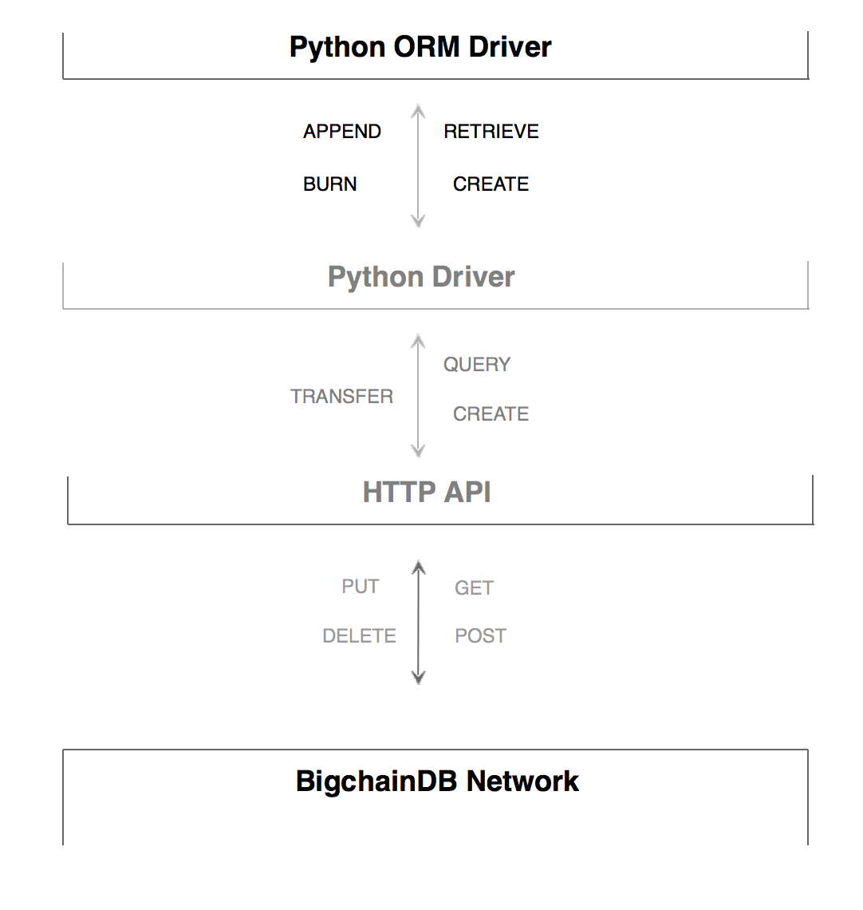

```
shortname: 21/PYTHON-ORM-DRIVER
name: Orm implementation for official bigchaindb python driver
type: Standard
status: raw
editor: Manan Patel <manan@bigchaindb.com>
```

# Abstract

This is a proposal to implement ORM based wrapper for official bigchaindb [python driver](https://github.com/bigchaindb/bigchaindb-driver). Official driver provides bare bones pyhton API on top of HTTP API to connect to BigchainDB network, but ORM implementation's aim is to provide a CRAB based operational model on top of official python API in order to simplify operations on bigchainDB network - thereby improving community adoption and engagement.  

## Language

The key words "MUST", "MUST NOT", "REQUIRED", "SHALL", "SHALL NOT", "SHOULD", "SHOULD NOT", "RECOMMENDED", "NOT RECOMMENDED", "MAY", and "OPTIONAL" in this document are to be interpreted as described in [BCP 14](https://tools.ietf.org/html/bcp14) \[[RFC2119](https://tools.ietf.org/html/rfc2119)\] \[[RFC8174](https://tools.ietf.org/html/rfc8174)\] when, and only when, they appear in all capitals, as shown here.

# Motivation

The need for this implementation is driven by following rationale -

* To provide simpler API to interact and perform operations on bigchainDB. Since, traditionally ORM based CRUD (Create, Read, Update, Delete) are the most used basic operations for the database (SQL and NoSQL), CRAB model for blockchains (bigchainDB in this case) reduces the learning curve for non-blockchain developers and improves community engagement. This is specifically true for python developers as Django (one of the most popular python framework) incorporates ORM model to perform CRUD operations.
* Our [ORM implementation](https://github.com/bigchaindb/js-driver-orm) of [javascript driver](https://github.com/bigchaindb/js-bigchaindb-driver) has recently shown good traction and usage within community.
* We would like to keep consistency with implementations related to both - javascript and python, offical drivers.  

# Specification

This Orm should be implemented on top of python driver - [https://github.com/bigchaindb/bigchaindb-driver](https://github.com/bigchaindb/bigchaindb-driver).
This implementation SHOULD include following **CRAB** operations -

1. **C**reate - performs CREATE transaction with asset payload into bigchainDB.
2. **R**etrieve - queries or fetches asset from bigchainDB.
3. **A**ppend - performs TRANSFER transaction with asset payload to a given public address in bigchainDB.
4. **B**urn - performs TRANSFER transaction with asset payload to a vanity address (in our case *BurnBurnBurnBurnBurnBurnBurnBurnBurnBurnBurn* - 11 times Burn) 

This implementation SHOULD also include tests and code coverage of atleast 95%.


# Architecture


## Current Architecture



## Architecture After ORM Implementation



# References

* [CRUD vs CRAB](https://blog.bigchaindb.com/crab-create-retrieve-append-burn-b9f6d111f460)
* [BigchainDB's official python driver](https://github.com/bigchaindb/bigchaindb-driver)
* [BigchainDB's official python driver documentation](https://docs.bigchaindb.com/projects/py-driver/en/latest/index.html)
* [BigchainDB's official javascript driver](https://github.com/bigchaindb/js-bigchaindb-driver)
* [ORM implementation of javascript driver](https://github.com/bigchaindb/js-driver-orm)
* [CRAB tutorial showing javascript ORM driver usage](https://github.com/bigchaindb/tutorial-crab)

# Copyright Waiver

_To the extent possible under law, the person who associated CC0 with this work has waived all copyright and related or neighboring rights to this work._